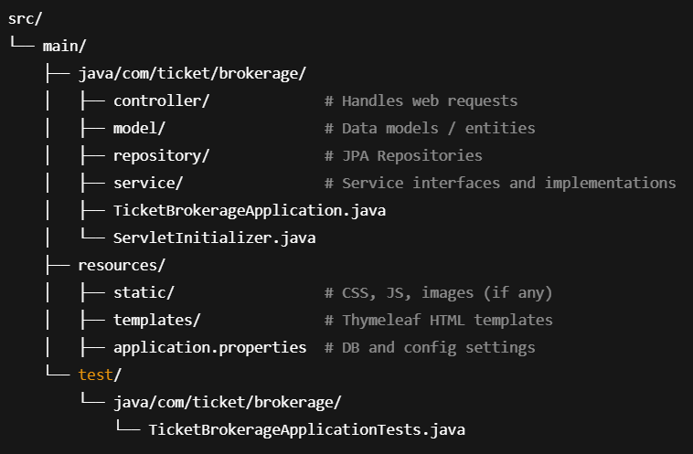

# 🚆 Train Ticket Selling Platform

A web-based platform that allows users to post, buy, and manage train tickets with secure login and payment handling. Built using Java Spring Boot and HTML/CSS/JavaScript.

🧩 Features
👤 User Login/Registration (Buyers & Sellers)

🎫 Post Train Tickets (by Sellers)

🔍 Search & Buy Available Tickets (by Buyers)

💳 Secure Payment Simulation with automatic transfer to seller

📄 Booking Confirmation page

🧾 Dashboards for sellers and buyers

⚠️ Error handling and validation

🛠️ Tech Stack
Layer	Technology
Frontend	HTML, CSS, JavaScript
Backend	Java Spring Boot
Template Eng.	Thymeleaf
Database	MySQL (configured via application.properties)
Build Tool	Maven

🚀 How to Run the Project
1. Clone the Repository

git clone https://github.com/PRANAVO02/ticket_Selling_platform.git
cd train-ticket-platform

3. Set Up the Database
Use the SQL script provided in db.sql to create necessary tables.

Update application.properties with your database credentials.

3. Run the Application
Open the project in IntelliJ or Eclipse

Run TicketBrokerageApplication.java (main class)

4. Access the Web App

http://localhost:8080

📁 Project Structure

Key HTML Pages:

home.html – Landing page

login.html, registration.html – Authentication

post-dashboard.html – Seller's dashboard

add-ticket.html – Post new ticket

buyer-dashboard.html – Buyer's view of available tickets

confirmation.html – Ticket purchase confirmation

error.html – Error display

🧪 Testing
Run tests from:

test/java/com/ticket/brokerage/TicketBrokerageApplicationTests.java

